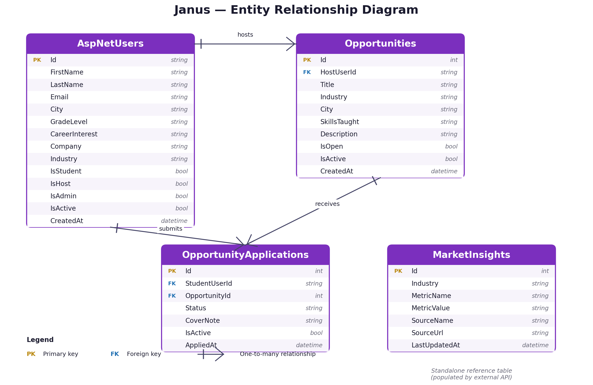

# Janus MVC

Janus is an ASP.NET Core MVC web application that connects high school students with working professionals for one-month career shadow experiences. Built as the final project for **ISM 6225 — Advanced Application Development** at the University of South Florida.

## Team

| Member                 | Role                                                       |
|------------------------|------------------------------------------------------------|
| Aya Bark               | MVC Conversion & Backend Architecture                      |
| Ashish Karamchandani   | API Integration                                            |
| Alessandro AlMeida     | Project Management, Frontend Development & Testing         |
| Kirti Tomar            | Azure SQL Database & Cloud Deployment                      |

## Main features

- MVC architecture with Controllers, Views, Models and ViewModels
- SQL Server LocalDB persistence through Entity Framework Core (Azure SQL ready)
- ASP.NET Core Identity for authentication, password hashing and role-based authorization
- Identity roles for Student, Host and Admin permissions
- Admin area for managing users, opportunities and applications
- Live labor market data via the U.S. Department of Labor's CareerOneStop API
- Seed data for demo users, opportunities, applications and market insights

## Demo accounts

| Role    | Email                       | Password    |
|---------|-----------------------------|-------------|
| Admin   | admin@janus.com             | Admin123!   |
| Host    | sarah.kim@tgh.org           | Host123!    |
| Student | maya.johnson@email.com      | Student123! |

## Tech stack

- ASP.NET Core MVC (.NET 10)
- Entity Framework Core
- SQL Server LocalDB (development) / Azure SQL Database (production-ready)
- ASP.NET Core Identity
- Bootstrap 5.3 + custom CSS
- CareerOneStop Web API for live labor market data

## Architecture

Janus follows a strict MVC separation:

- **Models/** — EF Core entities (`ApplicationUser`, `Opportunity`, `OpportunityApplication`, `MarketInsight`)
- **ViewModels/** — page-specific DTOs that views bind to
- **Controllers/** — request routing and orchestration
- **Views/** — Razor pages organized by controller
- **Data/** — `ApplicationDbContext` plus `DbInitializer` for seeding
- **Services/** — external integrations (CareerOneStop API client)
- **Areas/Admin/** — separate admin area for management screens

---

## Data model



The data model has four entities:

- **AspNetUsers** (single table representing Students, Hosts and Admins, distinguished by ASP.NET Identity roles)
- **Opportunities** — shadow experiences posted by Hosts
- **OpportunityApplications** — applications students submit to opportunities
- **MarketInsights** — labor market data populated from the CareerOneStop API

Core relationships:

- `AspNetUsers` 1 — \* `Opportunities` (a host posts many opportunities)
- `AspNetUsers` 1 — \* `OpportunityApplications` (a student submits many applications)
- `Opportunities` 1 — \* `OpportunityApplications` (an opportunity receives many applications)
- `MarketInsights` is a standalone reference table populated from the CareerOneStop API. It is not foreign-keyed to other tables — industry-level data isn't owned by any single user or opportunity.

A single `AspNetUsers` table represents Students, Hosts and Admins, distinguished by ASP.NET Identity roles. This avoids duplicate user tables and keeps authentication unified.

---

## CRUD implementation

Every core entity supports the full Create / Read / Update / Delete lifecycle. The table below summarizes which role performs each operation and where in the app it lives.

| Entity                      | Create                                          | Read                                                     | Update                                              | Delete                                              |
|-----------------------------|-------------------------------------------------|----------------------------------------------------------|-----------------------------------------------------|-----------------------------------------------------|
| **Opportunity**             | Hosts via `Opportunities/Create`; Admins via `/Admin/Opportunities/Create` | Public list at `/Opportunities`; details at `/Opportunities/Details/{id}` | Hosts via `Edit`; Admins via `/Admin/Opportunities/Edit` | Hosts via `Delete` (soft-delete via `IsActive` flag); Admins via `/Admin/Opportunities/Delete` |
| **OpportunityApplication**  | Students via `Applications/Apply`              | Students see own at `/Applications/MyApplications`; Hosts see those for their opportunities; Admins see all at `/Admin/Applications` | Hosts accept or decline via `Applications/Details`; Admins via `/Admin/Applications/Edit` | Students withdraw (soft-delete); Admins via `/Admin/Applications/Delete` |
| **ApplicationUser**         | Self-register at `/Account/Register` (Student or Host); Admins create via `/Admin/Users` | Admins view all at `/Admin/Users`; users view self at `/Users/MyProfile`; hosts viewable at `/Hosts/Details/{id}` | Users edit own at `/Users/EditProfile`; Admins via `/Admin/Users/Edit` | Users delete own at `/Users/DeleteAccount` (soft-delete via `IsActive` flag); Admins via `/Admin/Users/Delete` |
| **MarketInsight**           | Populated by CareerOneStop API on Insights search; seed data as fallback | Public read at `/Insights`                              | Auto-refreshed by API on search                     | Reseeded on database recreation                     |

### Patterns used across all CRUD operations

- **Server-side validation** through data annotations (`[Required]`, `[StringLength]`, `[RegularExpression]`) on view models
- **Anti-forgery tokens** on every POST form to prevent CSRF
- **`[Authorize(Roles = "...")]`** attributes restrict actions to the right roles (Student / Host / Admin)
- **Soft delete** via `IsActive` flag for `ApplicationUser`, `Opportunity` and `OpportunityApplication`, so historical records (and accepted applications) are preserved when entities are removed
- **Status enum** for applications (Pending / Accepted / Declined) enforced by a regex constraint on the database column

---

## Notable challenges and solutions

**1. Single user table for three roles.**
Rather than building separate `Student`, `Host` and `Admin` tables, we kept a single `ApplicationUser` entity and used ASP.NET Identity's role system to distinguish between roles. This keeps foreign keys (e.g., `Opportunity.HostUserId`) clean, lets a single account hold both Student and Host roles if needed, and avoids the pain of polymorphic relationships in EF Core. Role-specific fields (`GradeLevel`, `CareerInterest`, `Company`, `Industry`) are nullable on the same row and only populated for the relevant role.

**2. Unified registration with role-specific data.**
The original design had separate registration flows for students and hosts. We consolidated this into a single `/Account/Register` page with two tabs (`#student` and `#host`). Each tab posts to a dedicated action (`RegisterStudent` or `RegisterHost`) that creates the user, sets the appropriate role flag, and redirects appropriately. The homepage CTAs link directly to the right tab via URL anchor (`#student` or `#host`) so users land in the right form by default.

**3. Live API integration with graceful fallback.**
The `Insights` page calls a real external API (CareerOneStop) that can fail for any number of reasons — rate limits, network issues, invalid tokens, downtime. To prevent a third-party outage from breaking our page, the controller catches API failures, logs them, and falls back to the seeded `MarketInsights` data so users always see something useful. Successful API responses are cached in memory for six hours via `IMemoryCache` to minimize API calls and stay within rate limits.

**4. Cascading deletes vs. preserving history.**
EF Core's default cascade behavior would delete applications when a host removed an opportunity, which would lose acceptance records. We disabled cascade on that relationship and use the `IsActive` flag for soft-delete instead, so accepted applications and the audit trail stay intact even when a host removes their listing.

**5. Admin area routing.**
Putting admin pages under `Areas/Admin/` required registering an area route in `Program.cs` and using `[Area("Admin")]` on those controllers. The benefit is full URL-level separation (`/Admin/Users` vs. `/Users`) without controller name collisions, and the admin section can have its own layout, navigation and authorization policy.

---

## Changelog

### v1.2.0 — 2026-05-04

#### Authentication & Role Assignment
- `RegisterStudent` and `RegisterHost` now call `AddToRoleAsync` before `SignInAsync`, so the Identity role is included in the cookie from the very first login — previously registered users had no role claim, which broke all role-guarded pages
- All role checks across controllers and views now use `user.IsStudent` / `user.IsHost` as a fallback alongside `IsInRoleAsync`, making the app resilient to stale cookies

#### My Profile
- Added **Phone** field to the profile display (shown only when filled)
- Removed "Create Student Profile" and "Create Host Profile" buttons; replaced with **My Applications** (students) and **My Opportunities** (hosts)
- Already-student users navigating to `CreateStudentProfile` are now redirected to My Profile instead of seeing the form

#### Create Host Profile — Two-Step Flow
- Navigating to `/Users/CreateHostProfile` now shows a confirmation screen ("Create a Host Account? Yes / No") before displaying the form
- The form asks only for Company, Industry, and Bio (City is carried over silently from the existing profile)
- Already-host users are redirected to My Profile with a message

#### Opportunities Controller — Host Fixes
- Removed `[Authorize(Roles = HostRole)]` attributes from Create, Edit, and Delete actions; replaced with manual checks that accept both the role claim and the `IsHost` flag
- Fixed silent form failure on Create: `HostUserId` is `[Required]` on the model but not in the form for non-admin hosts — added `ModelState.Remove("Opportunity.HostUserId")` after setting it programmatically
- `LoadHostsAsync` now unions results from the role query and the `IsHost` flag so all host accounts appear in the admin dropdown
- Updated Create page subtitle from "Available only for hosts and admins." to "Post a new career shadow opportunity for students."

#### Apply Button — Role-Based Visibility
- Apply button on Opportunities Index and Details pages is now shown only when the user has the **Student** role (supports users who are both student and host)
- Access Denied page updated: replaced single "Go Home" button with three options — Back to Opportunities, My Applications, Go Home
- `Apply` POST action no longer uses `[Authorize(Roles = StudentRole)]`; manual check redirects to CreateStudentProfile instead of triggering Access Denied

#### Home Page — Context-Aware CTAs
- "Create Account" hero button hidden when the user is already logged in
- Student card shows "My Applications" for students, nothing for host-only users
- Host card shows "My Opportunities" for hosts, "Create Host Profile" (confirmation flow) for logged-in non-hosts, and Register link for guests

#### Mobile Responsiveness
- Opportunities table: hides Host, Industry, City, Skills columns on mobile; shows Title, Company, and action buttons only
- My Applications table: hides Host, Industry, Status, Applied columns on mobile; shows Opportunity, Company, Details button only
- Buttons no longer stretch to full width on mobile (removed global `width: 100%` from `@media (max-width: 576px)`); Home hero buttons unaffected
- Edit Profile save/cancel buttons wrapped in flex container for consistent mobile layout
- Added `.btn-sm-janus` CSS class for compact buttons inside tables

#### Navigation & Layout
- Removed **Hosts** link from nav menu and footer
- Removed **About** link from footer
- Removed demo account credentials from the Sign In page

#### Charts
- Second chart renamed from "Applications by Status" to **"Applications by Industry"**; query now joins `OpportunityApplications` with `Opportunities` to group by industry

---

### v1.1.0 — 2026-05-03

#### Authentication & Registration
- Replaced multi-step registration flow with a single combined page (`/Account/Register`) containing two tab sections: **Student Registration** (`#student`) and **Join as Host** (`#host`)
- Added `RegisterStudentViewModel`, `RegisterHostViewModel`, and `RegisterPageViewModel`
- Added `RegisterStudent` and `RegisterHost` POST actions to `AccountController`; each creates the user account and sets the appropriate role flag (`IsStudent` / `IsHost`) in one step
- Navigation: removed the "Register" link from the nav bar; renamed "Login" to "Sign In"; updated footer link to "Sign Up"

#### Homepage
- "Create Student Profile" and "Create Host Profile" buttons now link directly to `/Account/Register#student` and `/Account/Register#host`, opening the correct registration tab
- Registration page tabs scroll to the tab navigation area on arrival (anchor divs placed above the tab bar)
- Tab styling updated to site's `nav-tabs-janus` class: green/teal border and text when active, gray with no border when inactive

#### Industry field
- Added **"Other"** option to `AppConstants.Industries`, which propagates to all Industry dropdowns across the site (registration, create/edit opportunity, edit profile)
- Browse Opportunities filter excludes "Other" from the Industry dropdown (students cannot filter by "Other")

#### Admin area
- All boolean fields (`IsStudent`, `IsHost`, `IsAdmin`, `IsActive`, `IsOpen`) now display as **Yes / No** instead of True / False in all admin list and detail views (Users, Opportunities, Applications)
- Fixed explicit labels for **Open** and **Active** checkboxes on admin create/edit forms (were previously empty)

#### My Profile
- Replaced "Student: Yes/No" and "Host: No" static labels with role badges that appear only when the user holds that role (`Student`, `Host`, `Admin`)

#### Application Details
- Fixed "Back" button: students are now returned to **My Applications**; hosts are returned to **My Opportunities** (was always going to My Opportunities, causing a 403 for students)

#### Footer
- Removed My Profile, Create Student Profile, Create Host Profile, and Sign Up links from the footer
- Replaced with About and Hosts links

#### Account deletion
- Simplified confirmation message to: *"Once deleted, this account can no longer be accessed."*

#### About page
- Rewrote mission statement with Janus mythology framing (god of transitions, two faces looking at past and future)
- Added "Meet the Team" section with photos and roles for all four members
- Added link to GitHub README for technical documentation
- Replaced data model image with updated ERD generated from current entity classes

---

## Run locally

```bash
dotnet restore
dotnet build
dotnet ef database update
dotnet run
```

The `DbInitializer` seeds demo accounts on first run.

---

## CareerOneStop API Integration
*Implemented by Ashish Karamchandani*

The Market Insights page (`/Insights`) uses the CareerOneStop Web API sponsored by the U.S. Department of Labor to provide live labor market data.

### What it does
- Search any occupation by keyword (e.g. Nurse, Lawyer, Software Developer)
- Displays live median annual and hourly wages from BLS OEWS 2024 data
- Results are cached for 6 hours to minimize API calls
- Falls back to seeded database records if API is unavailable

### API Details

- **Provider:** CareerOneStop (www.careeronestop.org)
- **Base URL:** `https://api.careeronestop.org/v1/`
- **Data source:** Bureau of Labor Statistics Occupational Employment and Wage Statistics (OEWS)
- **Agreement expires:** 5/1/2029
- **Authentication:** Bearer token (stored in user secrets, not committed to repo)

### Endpoints used

| Step | Method | Endpoint                                                                |
|------|--------|--------------------------------------------------------------------------|
| 1    | `GET`  | `/v1/occupation/{userId}/{keyword}/us/0/5`                               |
| 2    | `GET`  | `/v1/comparesalaries/{userId}/wage?keyword={onetCode}&location=us`       |

The two calls are chained per search: results from the occupation search drive the wage requests, and the combined data populates the result cards on `/Insights`.

### Setup

The API token is not stored in the repository for security reasons. To enable live API results, add the token locally via User Secrets — otherwise the Insights search will fall back to seeded database data instead of live results.

Steps:

1. Open Visual Studio
2. Right-click the Janus project in Solution Explorer
3. Click **Manage User Secrets**
4. Paste the following into `secrets.json`:

   ```json
   {
     "CareerOneStop:Token": "<ask Aya Bark for the token>"
   }
   ```

The UserId is already in `appsettings.json` and does not need to be added.
